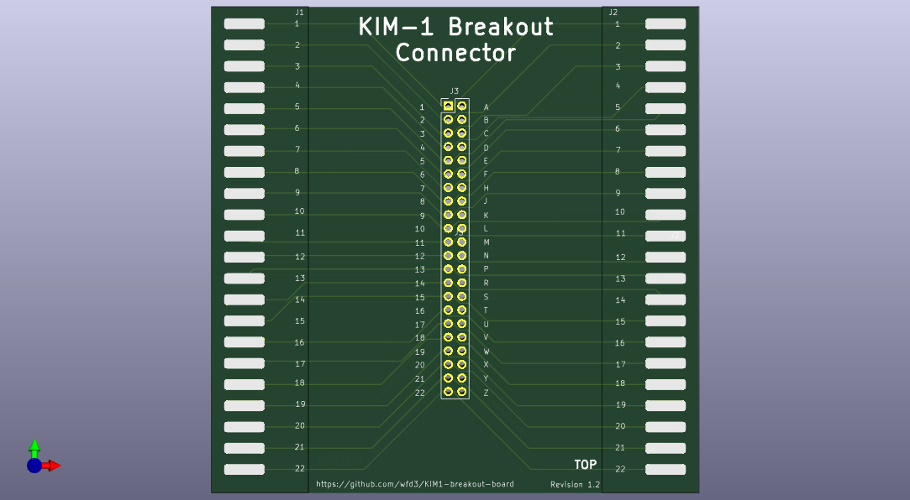

This is a very simple breakout extension for the [KIM-1](https://en.wikipedia.org/wiki/KIM-1) computer.  It attaches to either the Application or Expansion connector on the KIM-1 and brings the signals out to a standard 2x22 pin header, as well to an edge connector on the other side of the PCB.  This allows easy intergration with a breadboard for prototyping, or debugging the data flow between the KIM-1 and an external board. 

The edge connector is intended to accept a [Dual Edge Connector](https://google.com/search?q=305-044-500-202) from EDIC (part no. 305-044-500-202), and the pin header is designed for standard 2.45mm pitch pins. 
